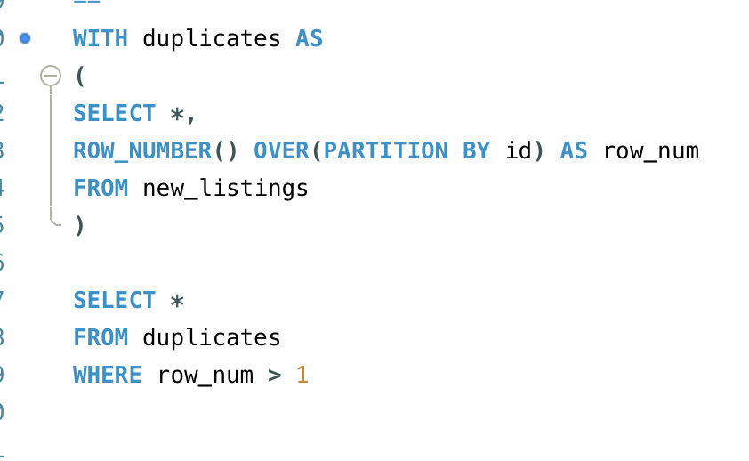

# Analysing Melbourne's Airbnb Market

## Introduction

Airbnb is a global online marketplace that connects travelers with hosts offering short-term rentals, ranging from private rooms to entire homes. Founded in 2008, the platform has revolutionized the hospitality industry by providing flexible accommodation options in cities and remote locations worldwide. 

Airbnb offers a wide variety of listings tailored to consumers' needs, including options based on location, dates, price, property type, and more. With millions of listings, Airbnb's data offers valuable insights into pricing trends, guest preferences, and market dynamics.

Melbourne, known for its vibrant culture, diverse neighborhoods, and strong tourism industry, is a city where Airbnb thrives. With major events, world-class dining, and a high demand for short-term accommodation, the platform plays a significant role in the city’s hospitality landscape. Visitors often choose Airbnb over traditional hotels for its variety of options, from budget-friendly apartments to luxury homes.

## Problem Statement

In this analysis, we will look at Airbnb data to uncover key characteristics of Melbourne’s short-term rental market. By examining factors such as pricing, availability, location trends, and property types, we aim to gain insights into how Airbnb operates within the city and what influences its market dynamics.

With the problem statement established, we can break it down into smaller objectives by answering the following questions:
1. Who are the top 10 hosts with the highest number of listings?
2. What are the top 10 neighbourhoods with the most listings?
3. What is the distribution of listings by the number of bedrooms?
4. And room type?
5. Which room types have the best reviews?
6. What are the most common minimum-nights required?
7. What is the average price per bedroom and room type?

## Executive Summary

## Data Source

Data source is obtained from [Melbourne Airbnb | September 2023 Dataset](https://www.kaggle.com/datasets/tauanoliveira/melbourne-airbnb-september-2023-dataset?resource=download). The data has 10708 rows and 75 columns.

## Data Cleaning

We want to clean the data to remove duplicate rows, fix or remove incorrect data, correcting formats, deal with outliers, and generally ensuring data is accurate and complete. 

### 1. Remove Columns

The dataset has 75 columns, of which we only need a subset of these. Create a new dataset - "new_listings" - with the following columns

### 2. Remove Duplicate Rows

As the id is unique for each listing, we look for repeated id's to single out duplicate rows and remove them from the new dataset new_listings.

We find no duplicates.

### 3. Missing Values

A straight forward querey iforms us of empty, null, or incorrect values - by incorrect here i mean nonsensical inputs e.g. negative pricing. What we find is empty cells in the following columns
1. description - 124 empty
2. neighbourhood - 3010 empty
3. bathrooms_text - 8 empty
4. bedrooms - 2972 empty
5. amenities - 7 empty

The only columns we can look at filling in missing values is for neighbourhood, bathrooms_text, and bedrooms as the name and description column seem to contain information about these.

#### Neighbourhood

A quick inspection of the name column shows that many listings contain the neighbourhood of the listings. The neighbourhoods are specified as "in 'sububrb, Melbourne,...'" and are then ended with "·". With this information we can update our table as follows

We only want the neighbourhood and not the city and state. Therefore, we need to keep the neighbourhood and discard the rest as now they are of the form "Neighbourhod, City, State" or "Neighbourhod. City. State". This is achieved as follows

After a quick inspection of the neighbourhood column, we notice two things that need mending and some additional comments.
- A few are left as "suburb/City" or "Suburb/City"
- There are listings of the same neighbourhood such as "St Kilda" and "Saint Kilda".
- To be extra careful we apply the TRIM function to remove any white space before or after the neighbourhood names.
- Don't need to worry about capitalisation as SQL and Tableau where we will analyse the data are not case sensitive.

  The first two issues are mended as follows

  

This concludes the cleaning of the neighbourhood column.

#### Bathrooms_text

Here we have 8 missing values. We first look at the description and name columns as we did earlier to see if these contain information. Running a querey to see if the name or description columns contain the word 'bath' for these empty rows proves ineffective, and demonstrates they do not contain any information about the bathroom.

As There are only 8 of these missing values it is worth visiting the listing_url to set the missing data. 

The following querey explains the findings in the lisitng_url

The listing with Id '38883439' had no information or photos but from the specified 2-bedroom townhouse I guessed 1 bathroom. Furthermore, Id '34046314' was outdated with the url taken down so I removed this row.

#### Bedrooms

There are 2972 empty rows in the bedrooms column. We first begin by checking the name column in each row for the words 'studio', 'bedroom', and 'bedrooms' and fill in the appearing number of bedrooms in the correct column. 

There were 16 rows where the name did not contain information about the bedrooms. Thus, these values for the bedrooms are now Null. When checking these 16 rows, 4 are studios as described in the desciption 

The remaining 12 are filled in by visiting the listing_url. 

When visiting the urls the following listing Id's (22488519, 40377799, 40510306, 46096289) are outdated and are deleted from the dataset.

Lastly, we dont need the word 'bedroom(s)' after the number so we will remove this from each row.

### 4. Data Type Conversions
